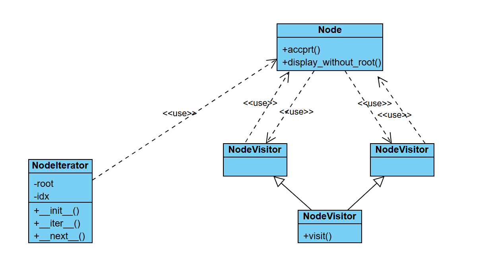
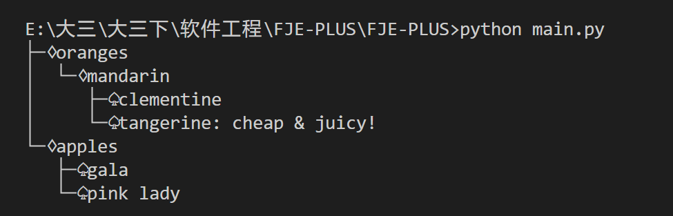
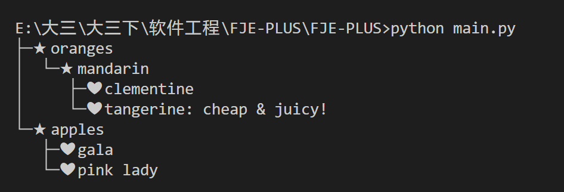
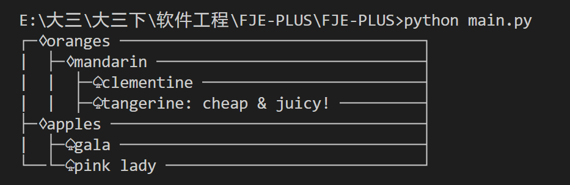
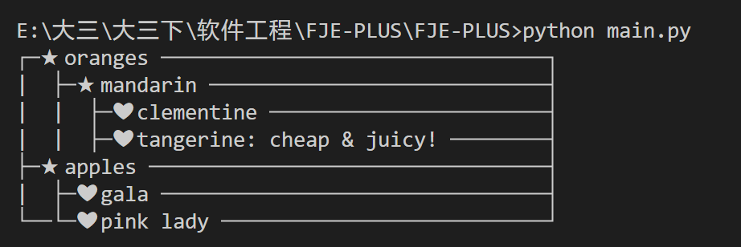

# Funny-Json-Explorer-PLUS (FJE-PLUS)
软件工程作业

## 使用
直接 `python main.py` 即可运行

图标的设置在 `iconFamily.py` 中设置

## 文件介绍

下面是原来的一些文件

* `styleFactory.py`：主要包含了工厂类，根据输入的类型返回对应的工厂类
* `node.py`：包含了树形、矩形节点
* `iconFamily.py`：图标族，可以自定义图标
* `builder.py`：构建节点
* `main.py`：主函数执行
* `results/`：四种结果保存的图片

接着是新增的文件

* `iterator.py`：主要包含了迭代器类
* `visitor.py`：主要包含了访问者类

## 迭代器模式和访问者模式

迭代器模式：

* NodeIterator类实现了迭代器模式，用于遍历节点树,__iter__和__next__方法定义了迭代器接口来遍历树。

迭代器模式将允许我们遍历一个复杂对象的所有元素，而不需要暴露其内部表示

---

访问者模式：

* NodeVisitor类是访问者接口，定义了一个visit方法
* TreeDisplayVisitor和RectangleDisplayVisitor是具体的访问者，实现了不同的显示策略
* Node类增加了accept方法，接收一个访问者，并调用访问者的visit方法，递归处理子节点

访问者模式将允许我们在不更改节点类的前提下，定义作用于这些类上的新操作

## 新增类图 & 结果展示

下面是展示的结果，可以看到能够正确展示

