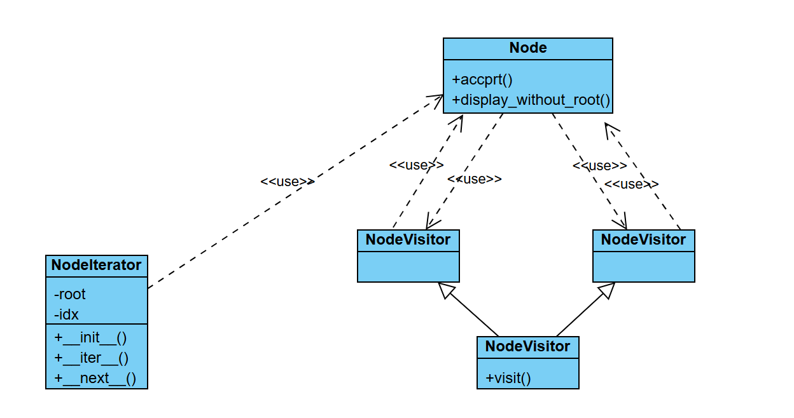
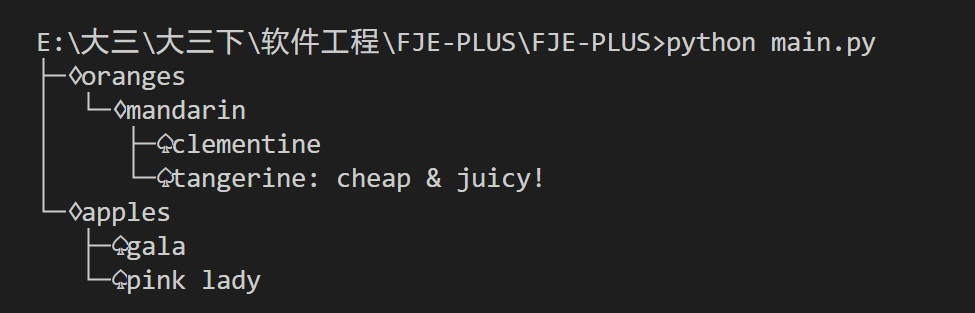
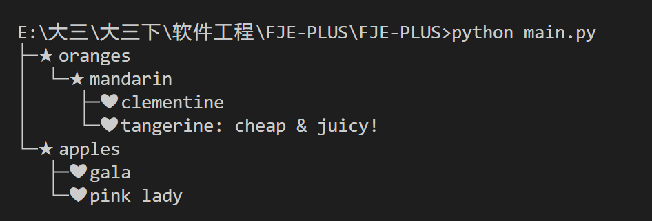
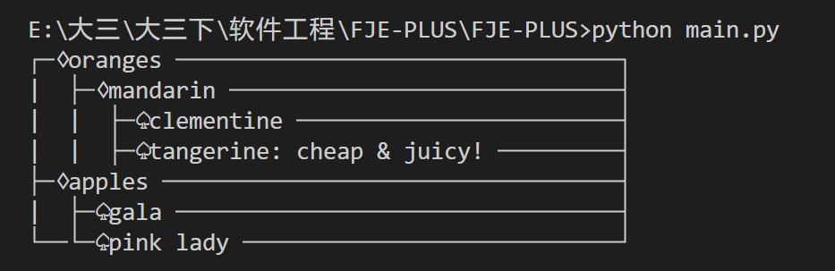
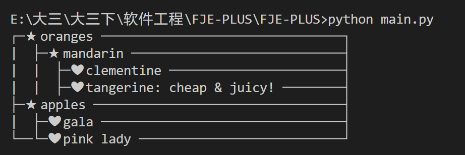

|姓名|学号|专业|
|-|-|-|
|黄世杰|21307038|计算机科学与技术|

## 文件与说明

下面是原来的一些文件

* `styleFactory.py`：主要包含了工厂类，根据输入的类型返回对应的工厂类
* `node.py`：包含了树形、矩形节点
* `iconFamily.py`：图标族，可以自定义图标
* `builder.py`：构建节点
* `main.py`：主函数执行
* `results/`：四种结果保存的图片

接着是新增的文件

* `iterator.py`：主要包含了迭代器类
* `visitor.py`：主要包含了访问者类

## 新增的类图

新增的类图：

## 迭代器模式和访问者模式

迭代器模式：

* NodeIterator类实现了迭代器模式，用于遍历节点树,__iter__和__next__方法定义了迭代器接口来遍历树。

迭代器模式将允许我们遍历一个复杂对象的所有元素，而不需要暴露其内部表示

---

访问者模式：

* NodeVisitor类是访问者接口，定义了一个visit方法
* TreeDisplayVisitor和RectangleDisplayVisitor是具体的访问者，实现了不同的显示策略
* Node类增加了accept方法，接收一个访问者，并调用访问者的visit方法，递归处理子节点

访问者模式将允许我们在不更改节点类的前提下，定义作用于这些类上的新操作

## 执行结果

